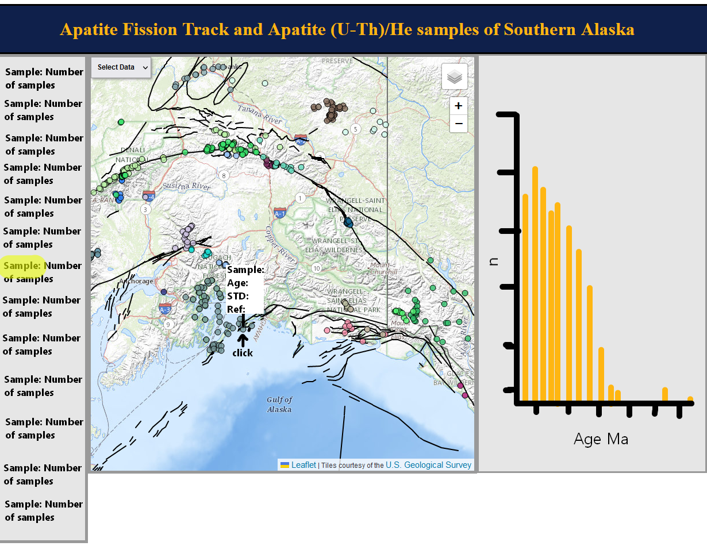
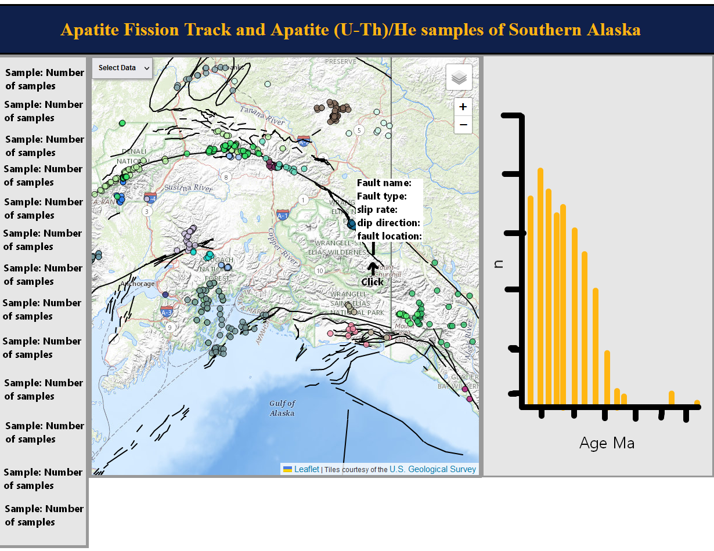
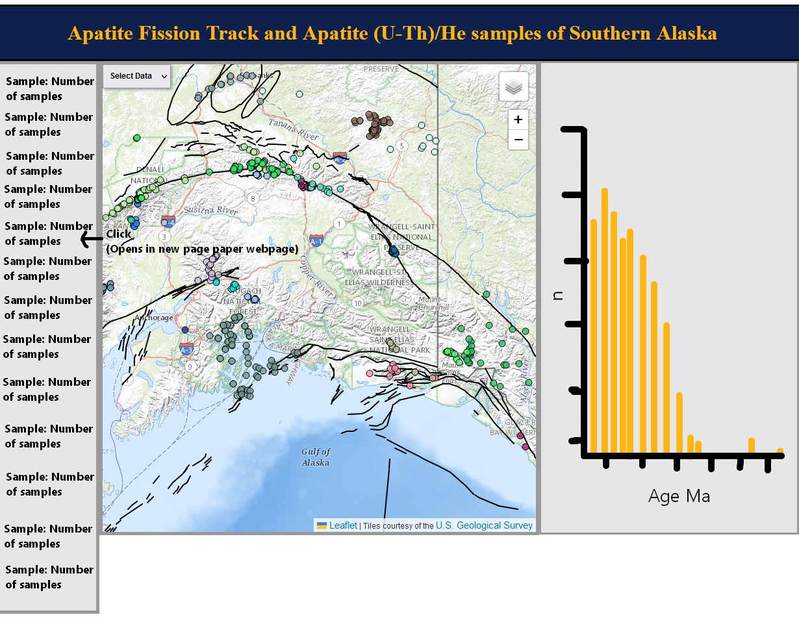
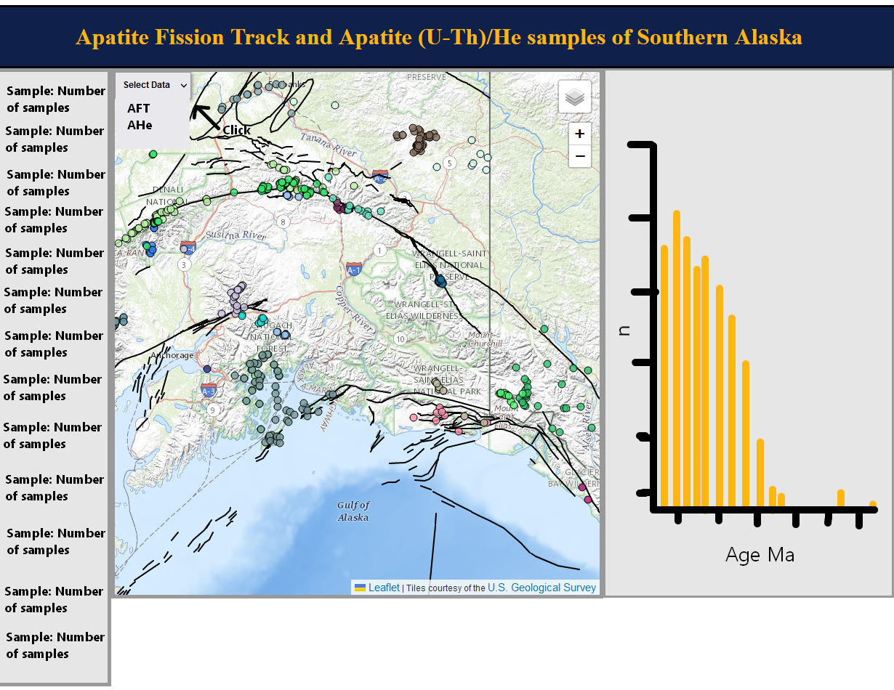
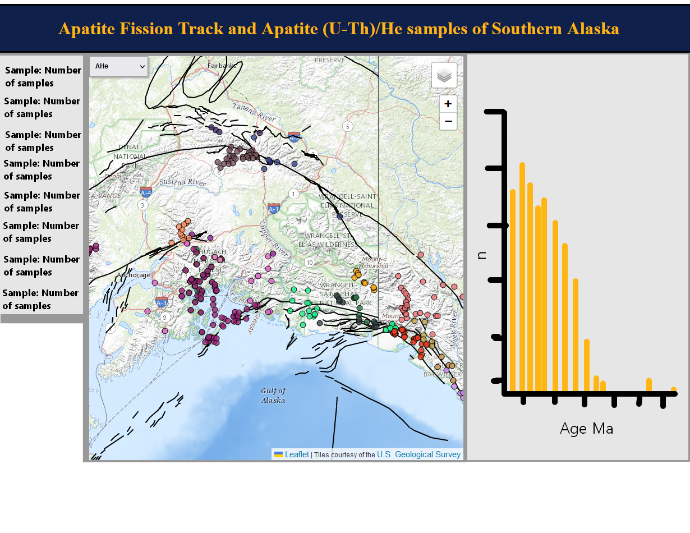
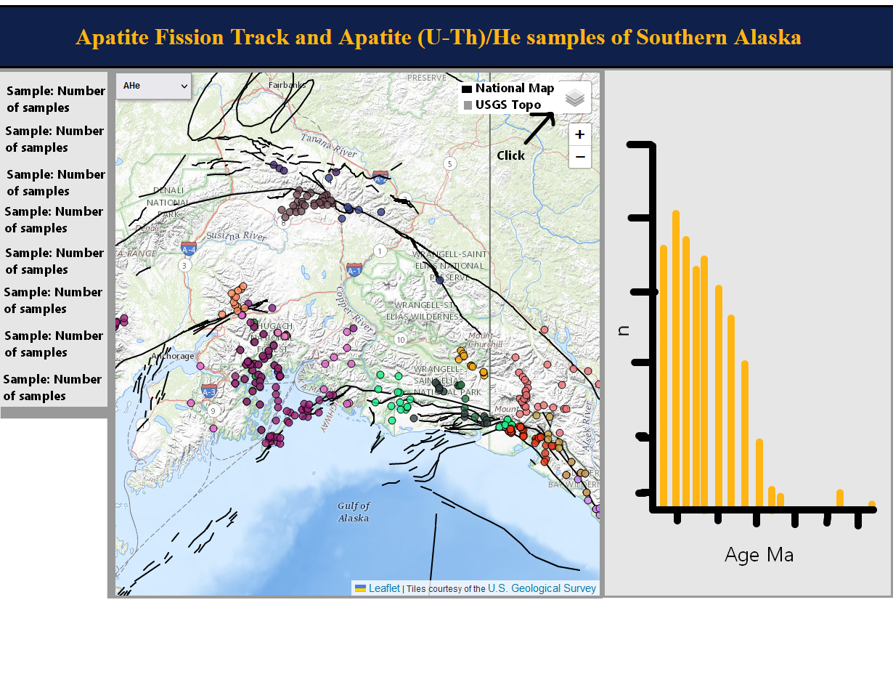
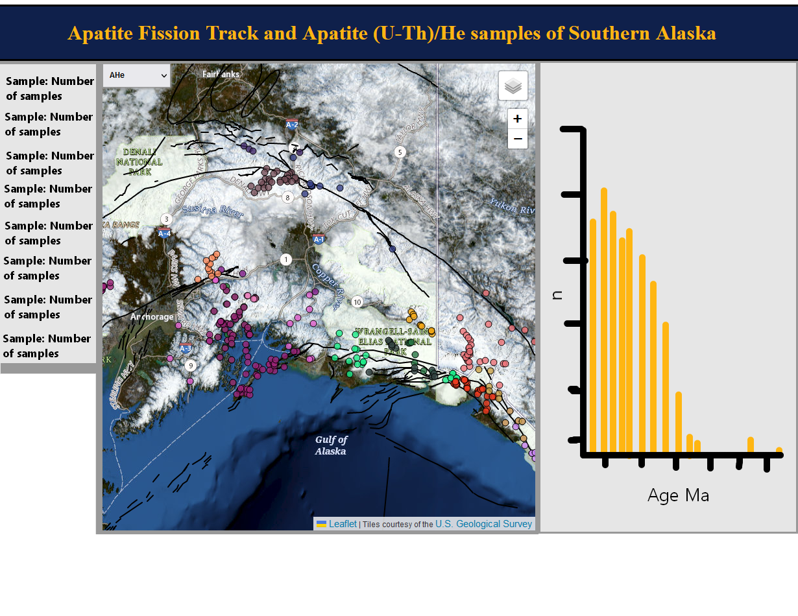

### Team Members
Alice Morris

### Final Proposal
1. Persona/Scenario
    1. Persona
		The target users are geology researchers looking for thermochronology, apatite fission tract (AFT) and apatite (U-Th)/He (AHe), data of Southern Alaska. Geologists’ expertise with technology ranges greatly with some having very little interaction with it, so design would need to be simple and easy to interpret. Their goal would be to be able to look at a map of a given thermochronology data set and quickly find the corresponding data.
    
	2. Scenario
		The page would contain a table on the left that contains the papers and quantities of AFT and AHe data collected from said papers. Users would also be able to click on the reference to take them directly to the specified paper. On the right side would be a graph showing distribution of ages for the given selected thermochronology type selected. In the centre would be the map visually showing locations of samples. In the top left of the map would be a dropdown menu to change from AFT and AHe data types. When a point on the map is clicked, the sample name, source, age of the sample in M.a., and the std in M.a. would appear in a popup. The corresponding reference would be highlighted in the table, allowing for easy discovery of papers with corresponding data in an area.

2. Requirements Document
	| abbreviated title | description of the source | description of the proposed symbolization |
	| --- | --- | --- |
	|Basemaps|basemap tileset from the USGS|National map and topomap from USGS|
	|Data|34 papers containing close to 700 unique samples of AHe and AFT data|Point feature, colored based on source|
	
	| abbreviated title | coding by operator and operand | description of the proposed interaction behavior and UI design |
	| --- | --- | --- |
	|Table|Link to external source|A source can be clicked to take one directly to the paper|
	|Map/Data|On click of data: popup|Data can be clicked and a popup of sample name, source, age and std in M.a. appears. Related source in the table would also be highlighted|
	|Layers|Dropdown menu switch data|Dropdown menu which can switch data from AFT and AHe|
	|Chart|Histogram with bin size of 2 Ma|Shows the age distribution for the current data type on the map|
	|Faults|Quaternary Faults and Folds of Alaska|Can be clicked to show popup of fault information|
	
3. Wireframes

### **Dependencies:**
* [Leaflet 1.9](https://leafletjs.com/reference-1.9.0.html)
* [D3] (https://d3js.org/)

### **Code Version:**
Last Updated: 22 Aug, 2023

### **Description:**
GEOG 575 Final project.